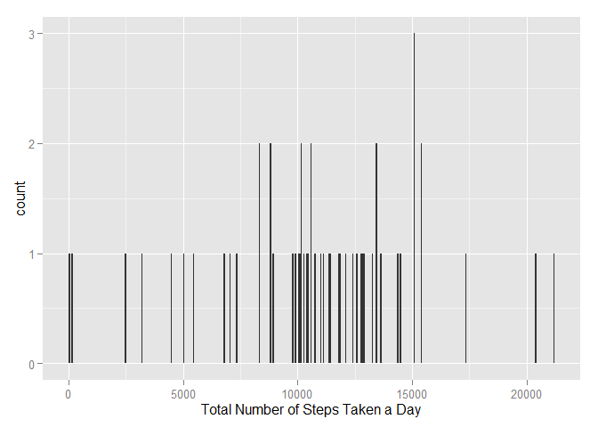
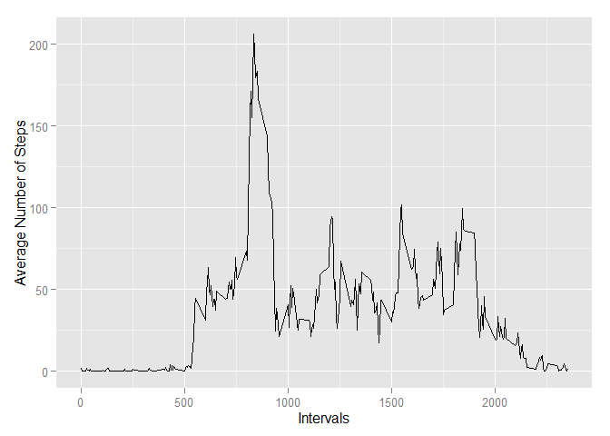
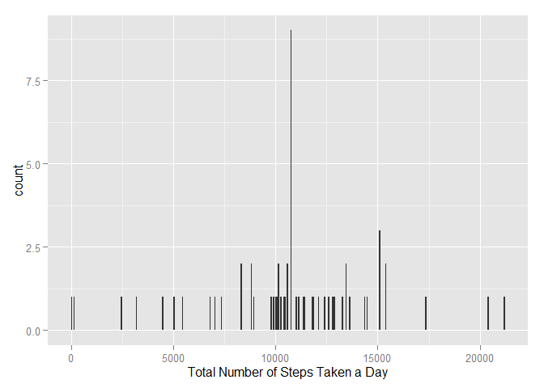
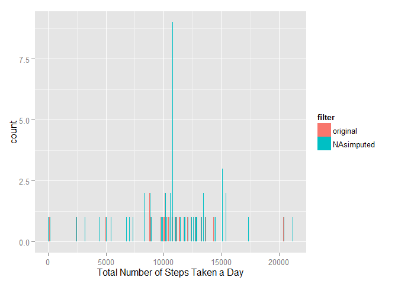
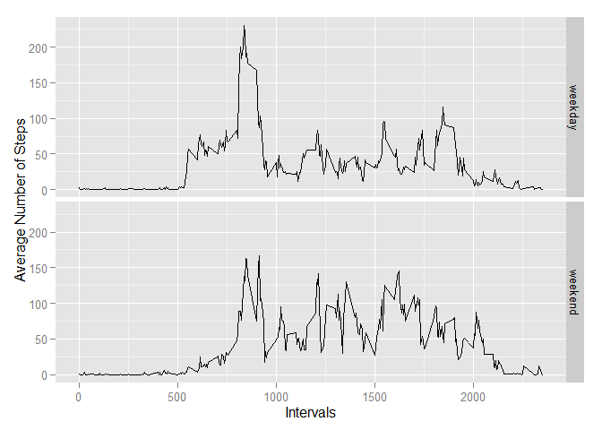

# Reproducible Research: Peer Assessment 1


```r
# set working directory
setwd("~/Coursera FULL/5 -- Reproducible Research/RepData_PeerAssessment1")

# load used libraries
library(dplyr)
```

```
## 
## Attaching package: 'dplyr'
## 
## The following objects are masked from 'package:stats':
## 
##     filter, lag
## 
## The following objects are masked from 'package:base':
## 
##     intersect, setdiff, setequal, union
```

```r
library(ggplot2)
library(scales)
library(lubridate)


options(scipen=999) # no scientific writing of numbers
```

## Loading and preprocessing the data

```r
# unzip and load the data file
df <- read.csv(unz("activity.zip", "activity.csv"))

# the "interval" variable counts 5-minutes intervals. However, this is not very handy and we'd like to replace it by a timestamp:
df <- df %>%
        mutate(interval =  sprintf("%04d", interval)) # add leading 0 if not yet 4

df$time <- paste(substr(as.character(df$interval), 1,2), substr(as.character(df$interval), 3,4), sep = ":")
df$timestamp <- strptime(paste(df$date, df$time), format = "%Y-%m-%d %H:%M")

df <- data.frame(df)


# and as usual, lets have a first look at the data:
summary(df)
```

```
##      steps                date         interval             time          
##  Min.   :  0.00   2012-10-01:  288   Length:17568       Length:17568      
##  1st Qu.:  0.00   2012-10-02:  288   Class :character   Class :character  
##  Median :  0.00   2012-10-03:  288   Mode  :character   Mode  :character  
##  Mean   : 37.38   2012-10-04:  288                                        
##  3rd Qu.: 12.00   2012-10-05:  288                                        
##  Max.   :806.00   2012-10-06:  288                                        
##  NA's   :2304     (Other)   :15840                                        
##    timestamp                  
##  Min.   :2012-10-01 00:00:00  
##  1st Qu.:2012-10-16 05:58:45  
##  Median :2012-10-31 11:57:30  
##  Mean   :2012-10-31 11:30:49  
##  3rd Qu.:2012-11-15 17:56:15  
##  Max.   :2012-11-30 23:55:00  
## 
```


## What is mean total number of steps taken per day?


```r
# calculate the total number of steps taken per day
stepseveryday <- df %>%
                        select(steps, date, interval)%>%
                        group_by(date) %>%
                        summarize(totalsteps = sum(steps))

# make a histogram of the total number of steps taken each day. as there are 61 days in total (since stepseveryday got 61 rows) I go for a binwidth of 61 to show every number in detail.
p <- ggplot(data = stepseveryday, aes(x = totalsteps)) +
        geom_histogram(binwidth = 61)
p + xlab("Total Number of Steps Taken a Day")
```

 

```r
# calculate and report the mean and median of the total number of steps taken per day
mean.totalsteps <- mean(stepseveryday$totalsteps, na.rm = TRUE)
median.totalsteps <- median(stepseveryday$totalsteps, na.rm = TRUE)
mean.totalsteps
```

```
## [1] 10766.19
```

```r
median.totalsteps
```

```
## [1] 10765
```

The mean of the total number of steps taken per day is 10766.1886792. The median of the total number of steps taken per day is 10765.

## What is the average daily activity pattern?

```r
# Make a time series plot (i.e. type = "l") of the 5-minute interval (x-axis) and the average number of steps taken, averaged across all days (y-axis)
avg.steps.per.interval <- df %>%
                                select(steps, date, interval) %>%
                                group_by(interval) %>%
                                summarize(averagesteps = mean(steps, na.rm = TRUE)) %>%
                                data.frame()

p <- ggplot(data = avg.steps.per.interval, aes(x = as.numeric(interval), y = averagesteps)) +
        geom_line()
p + xlab("Intervals") + 
    ylab("Average Number of Steps")
```

 

```r
# Which 5-minute interval, on average across all the days in the dataset, contains the maximum number of steps?
indexofmax <- which(avg.steps.per.interval$averagesteps == max(avg.steps.per.interval$averagesteps))
theinterval <- avg.steps.per.interval[indexofmax,"interval"]
theinterval
```

```
## [1] "0835"
```

On average, across all days in the dataset, the maximum number of steps have been counted during the 5-minute Interval from 0835:00 to 0835:59.

## Imputing missing values


```r
# Calculate and report the total number of missing values in the dataset (i.e. the total number of rows with NAs)

# first, lets have a look on how the NAs are spread over the columns
summary(select(df, steps, date, interval)) # its, as expected, in the stepse steps measurements only
```

```
##      steps                date         interval        
##  Min.   :  0.00   2012-10-01:  288   Length:17568      
##  1st Qu.:  0.00   2012-10-02:  288   Class :character  
##  Median :  0.00   2012-10-03:  288   Mode  :character  
##  Mean   : 37.38   2012-10-04:  288                     
##  3rd Qu.: 12.00   2012-10-05:  288                     
##  Max.   :806.00   2012-10-06:  288                     
##  NA's   :2304     (Other)   :15840
```

```r
total.na <- sum(is.na(df$steps))
total.na
```

```
## [1] 2304
```

The total number of missing values in the dataset is 2304

#### Strategy to Impute missing Values in the Dataset

I will go with a replacement by the rounded mean for that 5-minute interval. 


```r
#   Create a new dataset that is equal to the original dataset but with the missing data filled in.
df.NAsimputed <- df %>%
                        select(steps, date, interval)

df.NAsimputed$steps <- mapply(
                function(x,y){
                        if(is.na(x)){
                                index <- which(avg.steps.per.interval$interval == y)
                                x <- round(avg.steps.per.interval[index,"averagesteps"])
                               }
                        x
                        },
                df.NAsimputed$steps,
                df.NAsimputed$interval
                )    

summary(df.NAsimputed) # no NAs left, as desired
```

```
##      steps                date         interval        
##  Min.   :  0.00   2012-10-01:  288   Length:17568      
##  1st Qu.:  0.00   2012-10-02:  288   Class :character  
##  Median :  0.00   2012-10-03:  288   Mode  :character  
##  Mean   : 37.38   2012-10-04:  288                     
##  3rd Qu.: 27.00   2012-10-05:  288                     
##  Max.   :806.00   2012-10-06:  288                     
##                   (Other)   :15840
```

```r
#  Make a histogram of the total number of steps taken each day and Calculate and report the mean and median total number of steps taken per day. 

# we need to recalculate the total nr of steps taken every day
stepseveryday.NAsimputed <- df.NAsimputed %>%
                        group_by(date) %>%
                        summarize(totalsteps = sum(steps))

# histplot
p <- ggplot(data = stepseveryday.NAsimputed, aes(x = totalsteps)) +
        geom_histogram(binwidth = 61)
p + xlab("Total Number of Steps Taken a Day") 
```

 

```r
# calculate and report the mean and median of the total number of steps taken per day
mean.totalsteps.NAimp <- mean(stepseveryday.NAsimputed$totalsteps)
median.totalsteps.NAimp <- median(stepseveryday.NAsimputed$totalsteps)
mean.totalsteps.NAimp
```

```
## [1] 10765.64
```

```r
median.totalsteps.NAimp
```

```
## [1] 10762
```


#### Discussion Differences Dataset original and Dataset with imputed NAs

The mean of the original data set neglecting the NAs was 10766.1886792 and the median 10765.
After the imputation of the NAs by the rounded mean of this particular interval over all obeserved days, we gt a mean of 10765.6393443 which is a difference of 0.549335 compared to the original data.
The median lowers by 3 to 10762.

Also the histograms of the total numbers of steps taken each day differ.

```r
comparesteps <- rbind(data.frame(stepseveryday, filter = "original"),
                      data.frame(stepseveryday.NAsimputed, filter = "NAsimputed"))

p <- ggplot(data = comparesteps, aes(x = totalsteps, fill = filter)) +
        geom_histogram(binwidth = 61, position = "dodge")
p + xlab("Total Number of Steps Taken a Day") 
```

 

## Are there differences in activity patterns between weekdays and weekends?


```r
#  Create a new factor variable in the dataset with two levels – “weekday” and “weekend” indicating whether a given date is a weekday or weekend day.
Sys.setlocale("LC_TIME", "English") #as my sys language is not english
```

```
## [1] "English_United States.1252"
```

```r
df.NAsimputed$date <- as.Date(df.NAsimputed$date)
df.NAsimputed$weekday <- df.NAsimputed$date %>%
                                weekdays() 

df.NAsimputed$daytype <- sapply(df.NAsimputed$weekday,
                                function(x){
                                        if(x %in% c("Saturday", "Sunday")){
                                                x <- "weekend"
                                        } else {
                                                x <- "weekday"        
                                                }
                                        }) %>%
                        as.factor()


#  Make a panel plot containing a time series plot (i.e. type = "l") of the 5-minute interval (x-axis) and the average number of steps taken, averaged across all weekday days or weekend days (y-axis).

avg.steps.per.interval.NAimputed <- df.NAsimputed %>%
                                select(steps, date, interval, daytype) %>%
                                group_by(daytype,interval) %>%
                                summarize(averagesteps = mean(steps, na.rm = TRUE)) %>%
                                data.frame()

p <- ggplot(data = avg.steps.per.interval.NAimputed, 
            aes(x = as.numeric(interval), y = averagesteps)) +
        geom_line()
p + facet_grid(daytype ~ .) +
        xlab("Intervals") + 
        ylab("Average Number of Steps")
```

 

We observe that on average the muber of steps are higher during the weekend. Except for the measurements between 5 am and 10 am. During these times, we see that there were almost twice as much steps during the weekdays.
